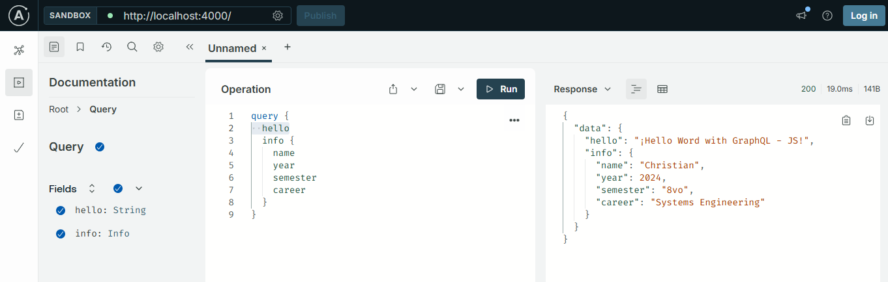
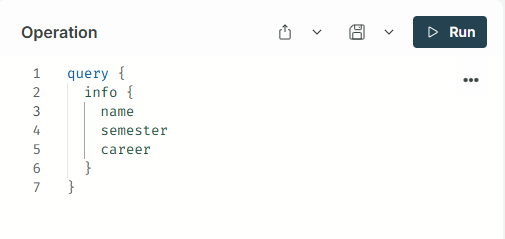
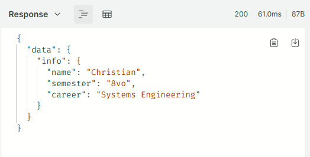

# 🌐 GraphQL API: Hello World - JavaScript 

This project is a basic application that uses **Apollo Server** and **GraphQL** to serve a "Hello World" query with additional user information. The goal is to demonstrate the fundamentals of how a GraphQL server works with Node.js.



---

## 🚀 **Technologies Used**  
- **Backend**: Node.js, Apollo Server, GraphQL  
- **Server**: Node.js Development Server  
- **Frontend**: N/A (Only API)

---

## 📖 **Prerequisites**  
Before running this project, make sure you have the following components installed:  
1. **Node.js** (Recommended: version 16 or higher)  
2. **Git**  
3. A text editor like **Visual Studio Code** (optional).  

---

## 🛠️ **Steps to Set Up and Run the Project**  

### 1️⃣ Clone the Repository  
Use the following command to clone the project from GitHub:  
```
git clone https://github.com/ciizao/GraphQL_JavaScript.git
```
### 2️⃣ Navigate to the Project Directory
Go to the project directory with the following command:
 ```
cd  GraphQl_JavaScript
```
### 3️⃣ Initialize the Node.js Project
If the `package.json` file hasn't been created yet, run the following command to initialize the project:
`npm init -y`

### 4️⃣ Install Dependencies
Install Apollo Server and GraphQL using the following command:
 ```
npm install apollo-server graphql
```
### 5️⃣  Run the Server
Start the server with the following command:
 ```
node index.js
```
### 6️⃣ Access the API
Open your browser and go to the following URL: `http://localhost:4000/`
* This will open the **Apollo GraphQL Playground**, where you can run queries.

### 7️⃣  Make a Query
In GraphQL Playground, you can run the following query to get the data, either all the user data or just fields that the client needs, by specifying in the Query



The response should look like this:




## 📂 Repository
* The source code for this project is available on GitHub:

```
https://github.com/ciizao/GraphQL_JavaScript.git
```